# Copilot Usage Advanced Dashboard Tutorial

- 中文版 [Copilot Usage Advanced Dashboard 教程](https://www.wolai.com/tNxKtCqCfb6DR2cuaxmJDZ)

## Table of contents

- [Introduction](#Introduction)
  - [Online Demo Environment](#Online-Demo-Environment)
    - [Copilot Usage Advanced Dashboard](#Copilot-Usage-Advanced-Dashboard)
    - [Copilot Usage Advanced Dashboard Original](#Copilot-Usage-Advanced-Dashboard-Original)
- [Variables](#Variables)
- [Features](#Features)
  - [Copilot Usage Advanced Dashboard](#Copilot-Usage-Advanced-Dashboard)
    - [1. Organization](#1-Organization)
    - [2. Teams](#2-Teams)
    - [3. Languages](#3-Languages)
    - [4. Editors](#4-Editors)
    - [5. Copilot Chat](#5-Copilot-Chat)
    - [6. Seat Analysis](#6-Seat-Analysis)
    - [7. Breakdown Heatmap](#7-Breakdown-Heatmap)
  - [Copilot Usage Advanced Dashboard Original](#Copilot-Usage-Advanced-Dashboard-Original)
    - [1. Copilot Seat Info & Top Languages](#1-Copilot-Seat-Info--Top-Languages)
    - [2. Copilot Usage Total Insight](#2-Copilot-Usage-Total-Insight)
    - [3. Copilot Usage Breakdown Insight](#3-Copilot-Usage-Breakdown-Insight)
- [Special Notes](#Special-Notes)
  - [Architecture diagram](#Architecture-diagram)
  - [Technology stack](#Technology-stack)
- [Deployment](#Deployment)
  - [Prerequisites](#Prerequisites)
  - [Docker](#Docker)
  - [Download source code](#Download-source-code)
  - [Elasticsearch](#Elasticsearch)
    - [Installation](#Installation)
    - [Create index](#Create-index)
  - [Grafana](#Grafana)
    - [Installation](#Installation)
    - [Create Admin Token](#Create-Admin-Token)
    - [Adding Data sources via API](#Adding-Data-sources-via-API)
    - [Generate Dashboard Json Model](#Generate-Dashboard-Json-Model)
    - [Import the generated Json to create a Dashboard](#Import-the-generated-Json-to-create-a-Dashboard)
  - [cpuad-updater](#cpuad-updater)
    - [Option 1. Run in docker mode (recommended)](#Option-1-Run-in-docker-mode-recommended)
    - [Option 2. Run in source code mode](#Option-2-Run-in-source-code-mode)
- [Congratulations](#Congratulations)
  - [Current application running status in the VM](#Current-application-running-status-in-the-VM)
  - [View Dashboard](#View-Dashboard)

---

| Ver      | Notice                   | By      | Date     |
| -------- | ------------------------ | ------- | -------- |
| 1.0&#xA; | doc creation             | Xuefeng | 20241217 |
| 1.1      | some update              | Xuefeng | 20241218 |
| 1.2      | add new grafana template | Xuefeng | 20241221 |

---

# Introduction

[Copilot Usage Advanced Dashboard](https://github.com/satomic/copilot-usage-advanced-dashboard "Copilot Usage Advanced Dashboard") is a single data panel display that almost fully utilizes data from Copilot APIs, The APIs used are:

- [List teams of an onganization](https://docs.github.com/en/enterprise-cloud@latest/rest/teams/teams?apiVersion=2022-11-28#list-teams "List teams of an onganization")
- [Get a summary of Copilot usage for a team](https://docs.github.com/en/enterprise-cloud@latest/rest/copilot/copilot-usage?apiVersion=2022-11-28#get-a-summary-of-copilot-usage-for-a-team "Get a summary of Copilot usage for a team")
- [Get Copilot seat information and settings for an organization](https://docs.github.com/en/enterprise-cloud@latest/rest/copilot/copilot-user-management?apiVersion=2022-11-28#get-copilot-seat-information-and-settings-for-an-organization "Get Copilot seat information and settings for an organization")
- [List all Copilot seat assignments for an organization](https://docs.github.com/en/enterprise-cloud@latest/rest/copilot/copilot-user-management?apiVersion=2022-11-28#list-all-copilot-seat-assignments-for-an-organization "List all Copilot seat assignments for an organization")

representing Copilot usage in multi organizations & teams from different dimensions.

## Online Demo Environment

> Designed 2 dashboards, both can exist at the same time in Grafana.


### Copilot Usage Advanced Dashboard

> Copilot Metrics Viewer compatible dashboard

> If you are familiar with the [copilot-metrics-viewer](<\[github-copilot-resources/copilot-metrics-viewer: Tool to visualize the Copilot metrics provided via the Copilot Business Metrics API (current in public beta)](https://github.com/github-copilot-resources/copilot-metrics-viewer)> "copilot-metrics-viewer") project, then please try this dashboard and use it in subsequent deployments.

- link: [http://20.89.179.123:3000/d/be7hpbvvhst8gc/copilot-usage-advanced-dashboard](http://20.89.179.123:3000/d/be7hpbvvhst8gc/copilot-usage-advanced-dashboard "http://20.89.179.123:3000/d/be7hpbvvhst8gc/copilot-usage-advanced-dashboard")
- username：`demouser`
- password：`demouser`

  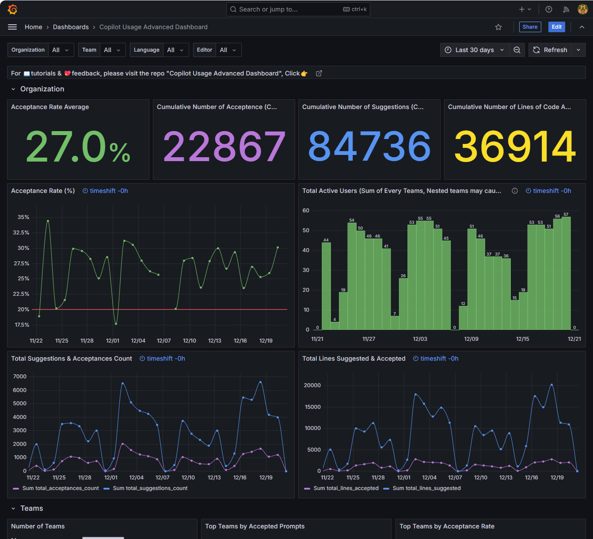

### Copilot Usage Advanced Dashboard Original

> New designed dashboard&#x20;

- Link: [http://20.89.179.123:3000/d/a98455d6-b401-4a53-80ad-7af9f97be6f4/copilot-usage-advanced-dashboard](http://20.89.179.123:3000/d/a98455d6-b401-4a53-80ad-7af9f97be6f4/copilot-usage-advanced-dashboard "http://20.89.179.123:3000/d/a98455d6-b401-4a53-80ad-7af9f97be6f4/copilot-usage-advanced-dashboard")
- username：`demouser`
- password：`demouser`

  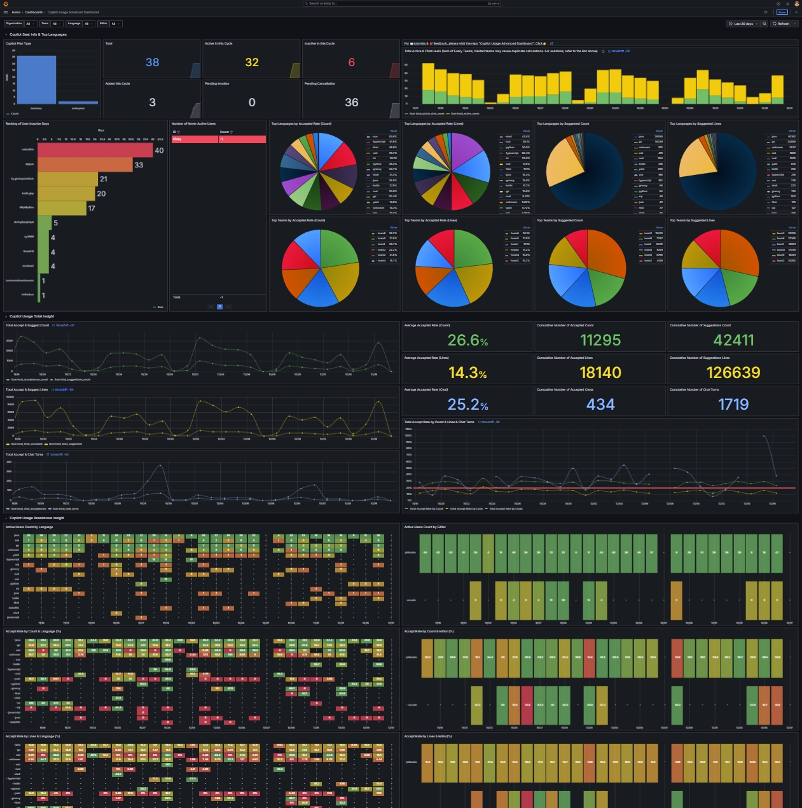

# Variables

Supports four filtering varibales, namely

- Organzation
- Team
- Language
- Editor

The choice of variables is dynamically associated with the data display


# Features

## Copilot Usage Advanced Dashboard

### 1. Organization

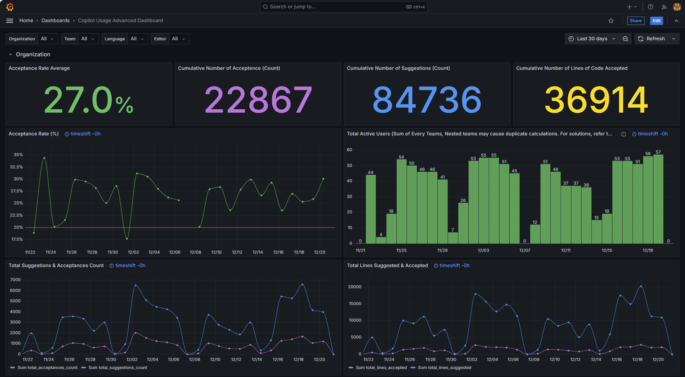

### 2. Teams

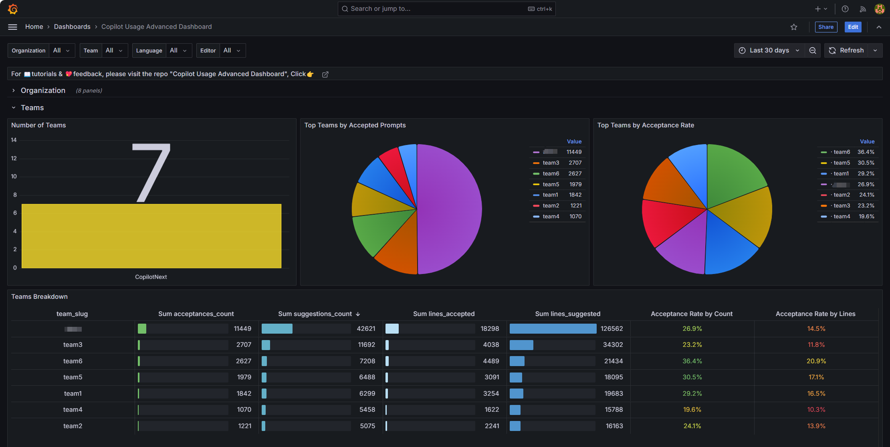

### 3. Languages


### 4. Editors

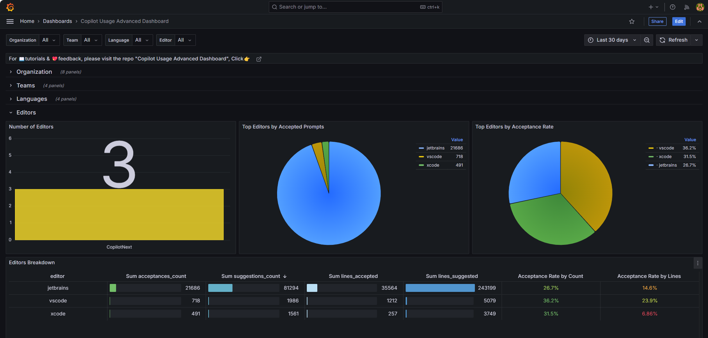

### 5. Copilot Chat

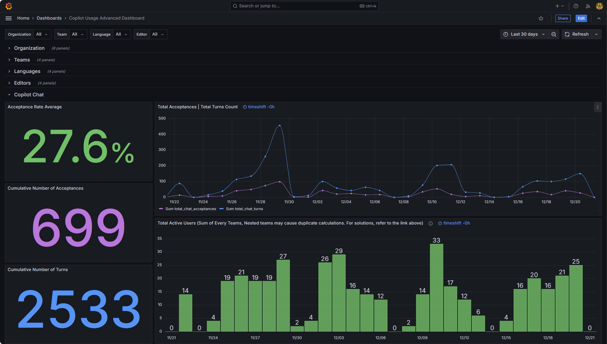

### 6. Seat Analysis

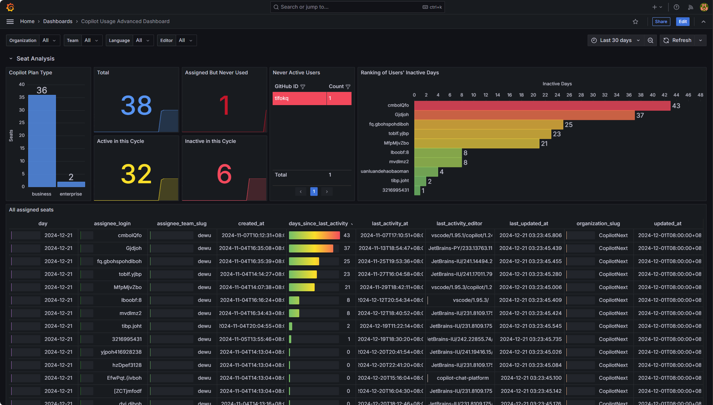

### 7. Breakdown Heatmap

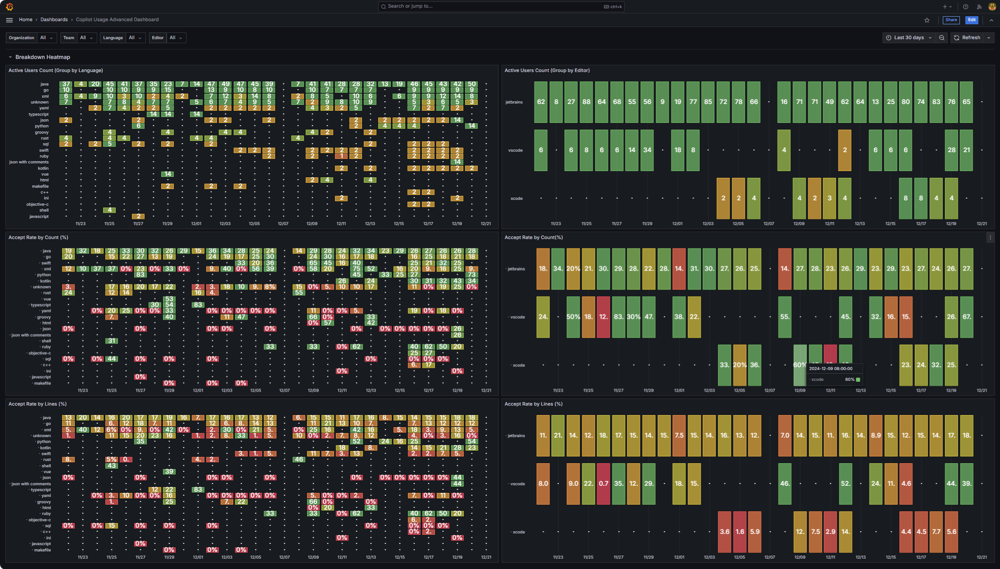

## Copilot Usage Advanced Dashboard Original

### 1. Copilot Seat Info & Top Languages

- You can view the distribution of seats, Enterprise or Business? and overall activation trends. And for users who don't use Copilot, they are ranked based on the length of inactivity and list users who have never activated.
- Ranking Language and Teams based on usage

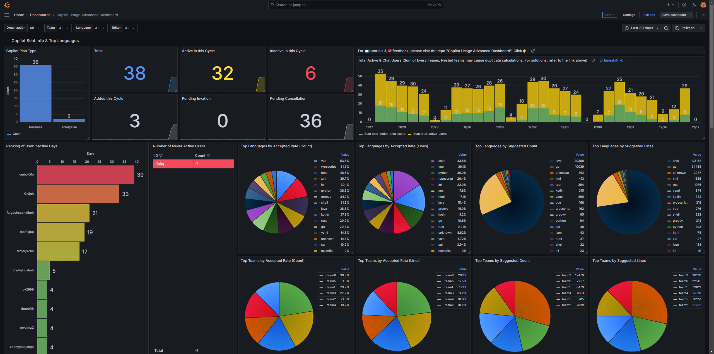

### 2. Copilot Usage Total Insight

You can analyze the total number of recommendations and adoption rate trends based on Count Lines and Chats


### 3. Copilot Usage Breakdown Insight

You can analyze the effect of Copilot in different languages ​​and different editor combinations.


***

# Special Notes

Everything described in this article is based on the all-in-one architecture. In a production environment, it can be split into a distributed architecture based on actual needs.

## Architecture diagram


## Technology stack

Dependent technology stack:

- VM
- docker
- Elasticsearch&#x20;
- Grafana
- Python3

***

# Deployment

> All operations are performed in the VM

## Prerequisites

> everything is on-premises and free (except VM)

The only thing you need is:

- a VM
  - Memory: 16G is recommended
  - Operating system: Ubuntu 22.04 (recommended, other operating systems have no difference except Docker installation)
  - Port: `3000` port needs to be released for Grafana to use, and `22` port can be determined by yourself.

Everything else is based on existing stuff, or based on open source software, no extra cost, for example:

- GitHub Organzations with Copilot enabled (I believe, you already have it)
- Docker (Community Version is enough)
- Elasticsearch (Community Version is enough)
- Grafana (Community Version is enough, do not need Grafana Cloud Account)
- CPUAD-Updater build from this project (MIT license)

## Docker

For installation instructions, refer to [Install Docker Engine](https://docs.docker.com/engine/install/ "Install Docker Engine"). For Ubuntu 22.04, you can use the following command

```bash
apt install docker.io
```

verify

```bash
docker version
```

The following content is obtained, indicating ok

```markdown
Client:
 Version:           24.0.7
 API version:       1.43
 Go version:        go1.21.1
 Git commit:        24.0.7-0ubuntu2~22.04.1
 Built:             Wed Mar 13 20:23:54 2024
 OS/Arch:           linux/amd64
 Context:           default

Server:
 Engine:
  Version:          24.0.7
  API version:      1.43 (minimum version 1.12)
  Go version:       go1.21.1
  Git commit:       24.0.7-0ubuntu2~22.04.1
  Built:            Wed Mar 13 20:23:54 2024
  OS/Arch:          linux/amd64
  Experimental:     false
 containerd:
  Version:          1.7.12
  GitCommit:
 runc:
  Version:          1.1.12-0ubuntu2~22.04.1
  GitCommit:
 docker-init:
  Version:          0.19.0
  GitCommit:

```

## Download source code

Put all the work in the `/srv` directory, click [download zip archive](https://github.com/satomic/copilot-usage-advanced-dashboard/archive/refs/heads/main.zip "download zip archive"), unzip and rename the folder to `copilot-usage-advanced-dashboard`, or directly `git clone`

```bash
cd /srv
git clone https://github.com/satomic/copilot-usage-advanced-dashboard.git
cd copilot-usage-advanced-dashboard

```

verify

```bash
ls -ltr
```

The following content is obtained, indicating ok

```bash
total 64
-rw-r--r-- 1 root root   100 Dec 16 11:22 fetch.sh
-rw-r--r-- 1 root root    56 Dec 16 11:22 docker_build.sh
-rw-r--r-- 1 root root  1063 Dec 16 11:22 LICENSE
-rw-r--r-- 1 root root  1031 Dec 16 11:22 Dockerfile
-rw-r--r-- 1 root root   193 Dec 16 11:22 push.sh
drwxr-xr-x 2 root root  4096 Dec 16 11:22 mapping
-rw-r--r-- 1 root root    22 Dec 16 11:32 requirements.txt
-rw-r--r-- 1 root root   996 Dec 16 13:44 log_utils.py
drwxr-xr-x 2 root root  4096 Dec 17 00:18 grafana
-rw-r--r-- 1 root root  2571 Dec 17 00:18 gen_grafana_model.py
-rw-r--r-- 1 root root 22500 Dec 17 01:40 main.py

```

## Elasticsearch

### Installation

> If you already have ES, you can skip this step and go directly to the next step.

> ES will not be exposed to the outside of the VM, so there is no need to enable `xpack.security.enabled`

1. Create a data persistence directory and a configuration file directory for Elasticsearch:
   ```bash
   mkdir -p /srv/elasticsearch/data /srv/elasticsearch/config
   ```
2. Grant read and write permissions.
   ```bash
   chown -R 777 /srv/elasticsearch/
   ```
3. Create the `elasticsearch.yml` configuration file in the `/srv/elasticsearch/config/`directory:
   ```bash
   cat >> /srv/elasticsearch/config/elasticsearch.yml << EOF
   network.host: 0.0.0.0
   node.name: single-node
   cluster.name: es-docker-cluster
   path.data: /usr/share/elasticsearch/data
   path.logs: /usr/share/elasticsearch/logs
   discovery.type: single-node
   bootstrap.memory_lock: true
   EOF
   ```
4. Use the following command to start Elasticsearch and bind the data directory and configuration file:
   ```bash
   docker run -itd --restart always --name es \
     -p 9200:9200 \
     -e "xpack.security.enabled=false" \
     -e "ES_JAVA_OPTS=-Xms4g -Xmx4g" \
     -v /srv/elasticsearch/data:/usr/share/elasticsearch/data \
     -v /srv/elasticsearch/config/elasticsearch.yml:/usr/share/elasticsearch/config/elasticsearch.yml:ro \
     docker.elastic.co/elasticsearch/elasticsearch:8.17.0

   ```
5. verify
   ```bash
   curl http://localhost:9200
   ```
   The following content is obtained, indicating ok
   ```bash
   {
       "name": "single-node",
       "cluster_name": "es-docker-cluster",
       "cluster_uuid": "oO3mfjYWTZ6VZFSClDiSLA",
       "version": {
           "number": "8.17.0",
           "build_flavor": "default",
           "build_type": "docker",
           "build_hash": "2b6a7fed44faa321997703718f07ee0420804b41",
           "build_date": "2024-12-11T12:08:05.663969764Z",
           "build_snapshot": false,
           "lucene_version": "9.12.0",
           "minimum_wire_compatibility_version": "7.17.0",
           "minimum_index_compatibility_version": "7.0.0"
       },
       "tagline": "You Know, for Search"
   }
   ```

### Create index

1. Confirm that you are in the correct path
   ```bash
   cd /srv/copilot-usage-advanced-dashboard
   ```
2. Execute the script and create an index
   ```bash
   bash create_es_indexes.sh
   ```
   The following content is obtained, indicating ok
   ```json
   {"acknowledged":true,"shards_acknowledged":true,"index":"copilot_usage_total"}
   {"acknowledged":true,"shards_acknowledged":true,"index":"copilot_usage_breakdown"}
   {"acknowledged":true,"shards_acknowledged":true,"index":"copilot_seat_info_settings"}
   {"acknowledged":true,"shards_acknowledged":true,"index":"copilot_seat_assignments"}
   ```
3. verify
   ```bash
   curl -X GET http://localhost:9200/_cat/indices?v
   ```
   The following content is obtained, indicating ok
   ```markdown
   health status index                      uuid                   pri rep docs.count docs.deleted store.size pri.store.size dataset.size
   yellow open   copilot_usage_total        XrOEfAngTS60VsuUz3Lbrw   1   1          0            0       227b           227b         227b
   yellow open   copilot_seat_info_settings WtOBdBNUQRqua7wi7VANeQ   1   1          0            0       227b           227b         227b
   yellow open   copilot_seat_assignments   lK5t4SwASZizPQ_W4NX4KQ   1   1          0            0       227b           227b         227b
   yellow open   copilot_usage_breakdown    xE6tkg5GQEOP-EP8pwAkYg   1   1          0            0       227b           227b         227b

   ```

## Grafana

### Installation

> If you already have Grafana, you can skip this step and go directly to the next step.

1. Creating a Data Path
   ```bash
   mkdir -p /srv/grafana/data
   chmod 777 /srv/grafana/data
   ```
2. run
   ```bash
   docker run  -itd --restart always --name=grafana \
     --net=host \
     -p 3000:3000 \
     -v /srv/grafana/data:/var/lib/grafana \
     -e "GF_LOG_LEVEL=debug" \
     grafana/grafana:11.4.0
   ```
3. Access Grafana
   - Access address: `http://<PUBLIC_IP_OF_YOUR_VM>:3000`
   - The default username and password are `admin`/ `admin`, please change the password

### Create Admin Token

1. admin visit \*\*Administration \*\*→ **Users and access** → **Service accounts**

   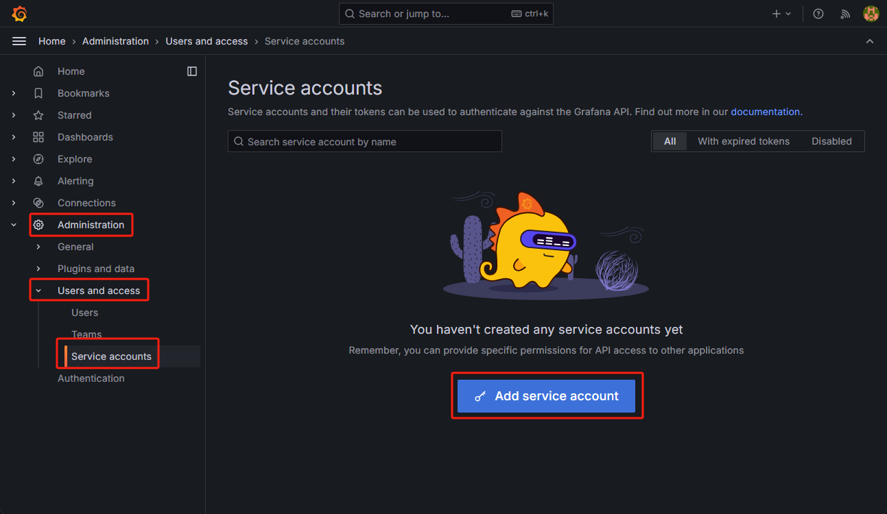
2. input\*\* Display name\*\*，**Role **select`Admin`**, Create**

   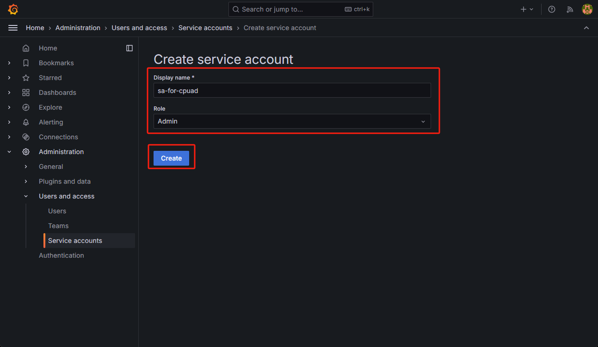
3. click **Add service account token**

   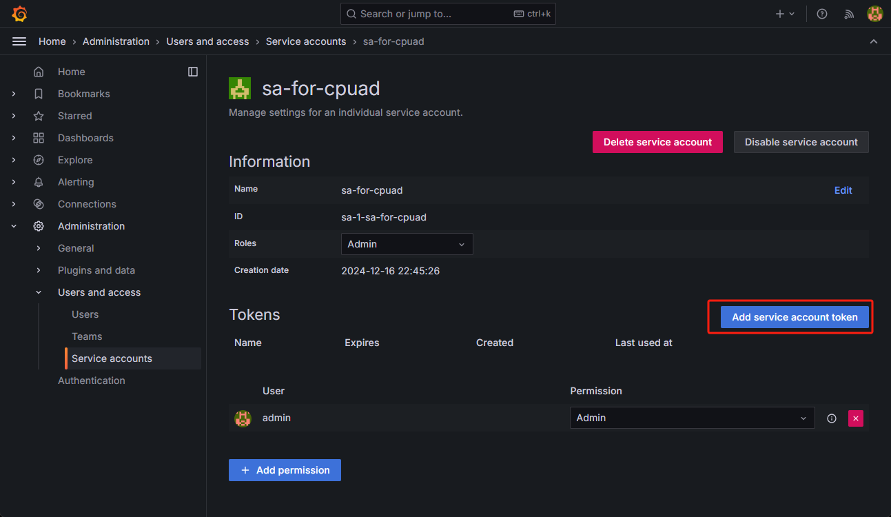
4. click **Generate token**

   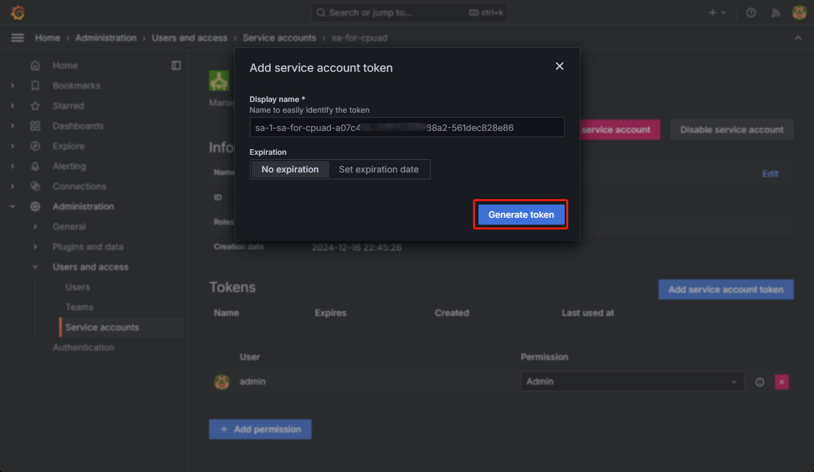
5. **Copy to clipboard and close**

   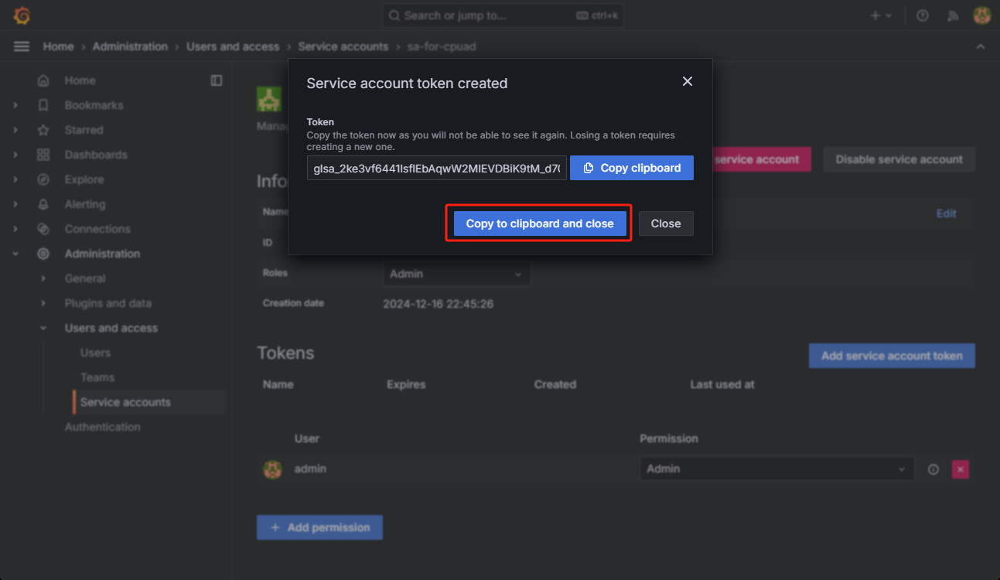
6. Now, you have obtained your Grafana Token `"<your_grafana_token>"`, please save it and set it as an environment variable in the VM, which will be used in the next steps.
   ```javascript
   export GRAFANA_TOKEN="<your_grafana_token>"
   ```

### Adding Data sources via API

1. Confirm that you are in the correct path
   ```bash
   cd /srv/copilot-usage-advanced-dashboard
   ```
2. run script, add data sources
   ```bash
   bash add_grafana_data_sources.sh
   ```
3. Visit the Grafana UI to confirm that the addition was successful

   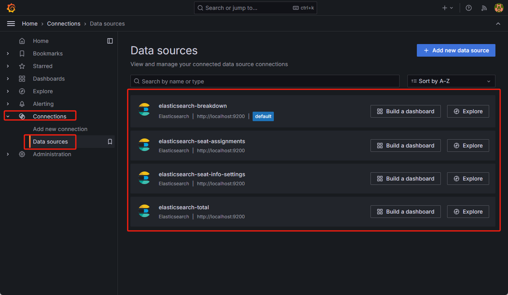

### Generate Dashboard Json Model

1. Confirm that you are in the correct path
   ```bash
   cd /srv/copilot-usage-advanced-dashboard
   ```
2. Execute the script to generate a Grafana json model. Execute one of the following two commands
   ```python
   # Generate Copilot Usage Advanced Dashboard
   python3 gen_grafana_model.py --template=grafana/dashboard-template.json

   # Generate Copilot Usage Advanced Dashboard Original
   python3 gen_grafana_model.py --template=grafana/dashboard-template-original.jso

   ```
   Get the output
   ```markdown
   Model saved to grafana/dashboard-model-2024-12-17.json, please import it to Grafana
   ```

### Import the generated Json to create a Dashboard

1. Download the generated file to your local computer
   ```bash
   scp root@<PUBLIC_IP_OF_YOUR_VM>:/srv/copilot-usage-advanced-dashboard/grafana/dashboard-model-*.json .
   dashboard-model-2024-12-17.json                                                                                                                                                  100%  157KB 243.8KB/s   00:00
   dashboard-model-data_sources_name_uid_mapping-2024-12-17.json                                                                                                                    100%  210     1.1KB/s   00:00
   ```
2. Copy the generated json file and import it into Grafana

   

   Select the file to import, or paste the content directly

   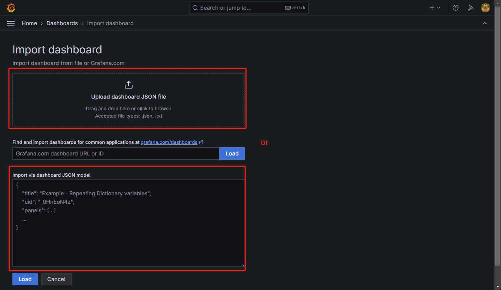
3. **Import**

   
4. Congratulations, you now have a complete dashboard, but there should be no data yet. Next, run the core program.

## cpuad-updater

> is the abbreviation of the first characters of **Copilot Usage Advanced Dashboard Updater**

### Option 1. Run in docker mode (recommended)

Parameter description

- `GITHUB_PAT`: Your GitHub PAT, which needs to have Owner permissions for Organizations. Please replace `<YOUR_GITHUB_PAT>` with the actual value.
- `ORGANIZATION_SLUGS`: The Slugs of all Organizations that you want to monitor, which can be one or multiple separated by `,` (English symbol). Please replace `<YOUR_ORGANIZATION_SLUGS>` with the actual value. For example, the following types of values are supported:
  - `myOrg1`
  - `myOrg1,myOrg2`
- `LOG_PATH`: Log storage location, not recommended to modify. If modified, you need to modify the `-v` data volume mapping simultaneously.
- `EXECUTION_INTERVAL`: Update interval, the default is to update the program every `1` hours.

```bash
docker run -itd \
--net=host \
--restart=always \
--name cpuad \
-e GITHUB_PAT="<YOUR_GITHUB_PAT>" \
-e ORGANIZATION_SLUGS="<YOUR_ORGANIZATION_SLUGS>" \
-e LOG_PATH="logs" \
-e EXECUTION_INTERVAL=1 \
-e ELASTICSEARCH_URL="http://localhost:9200" \
-v /srv/cpuad-updater-logs:/app/logs \
satomic/cpuad-updater
```

### Option 2. Run in source code mode

1. Confirm that you are in the correct path
   ```bash
   cd /srv/copilot-usage-advanced-dashboard
   ```
2. Install Dependencies
   ```bash
   python3 -m pip install -r requirements.txt
   ```
3. Setting Environment Variables
   ```bash
   export GITHUB_PAT="<YOUR_GITHUB_PAT>"
   export ORGANIZATION_SLUGS="<YOUR_ORGANIZATION_SLUGS>"

   ```
4. run
   ```bash
   python3 main.py
   ```
5. output logs
   ```text
   2024-12-17 05:32:22,292 - [INFO] - Data saved to logs/2024-12-17/nekoaru_level3-team1_copilot_usage_2024-12-17.json
   2024-12-17 05:32:22,292 - [INFO] - Fetched Copilot usage for team: level3-team1
   2024-12-17 05:32:22,293 - [INFO] - Data saved to logs/2024-12-17/nekoaru_all_teams_copilot_usage_2024-12-17.json
   2024-12-17 05:32:22,293 - [INFO] - Processing Copilot usage data for organization: nekoaru
   2024-12-17 05:32:22,293 - [INFO] - Processing Copilot usage data for team: level1-team1
   2024-12-17 05:32:22,293 - [WARNING] - No Copilot usage data found for team: level1-team1
   2024-12-17 05:32:22,293 - [INFO] - Processing Copilot usage data for team: level2-team1
   2024-12-17 05:32:22,293 - [WARNING] - No Copilot usage data found for team: level2-team1
   2024-12-17 05:32:22,293 - [INFO] - Processing Copilot usage data for team: level2-team2
   2024-12-17 05:32:22,293 - [WARNING] - No Copilot usage data found for team: level2-team2
   2024-12-17 05:32:22,293 - [INFO] - Processing Copilot usage data for team: level3-team1
   2024-12-17 05:32:22,293 - [WARNING] - No Copilot usage data found for team: level3-team1
   2024-12-17 05:32:22,293 - [INFO] - Sleeping for 6 hours before next execution...
   2024-12-17 05:32:22,293 - [INFO] - Heartbeat: still running...

   ```

***

# Congratulations

## Current application running status in the VM

At this moment, in the VM, you should be able to see 3 containers running (if you have deployed them from scratch based on docker), as follows:

```bash
docker ps

CONTAINER ID   IMAGE                                                  COMMAND                  CREATED        STATUS        PORTS                                                 NAMES
1edffd12a522   satomic/cpuad-updater:20241221                         "python3 main.py"        23 hours ago   Up 10 hours                                                         cpuad
b19e467d48f1   grafana/grafana:11.4.0                                 "/run.sh"                25 hours ago   Up 10 hours                                                         grafana
ee35b2a340f1   docker.elastic.co/elasticsearch/elasticsearch:8.17.0   "/bin/tini -- /usr/l…"   3 days ago     Up 10 hours   0.0.0.0:9200->9200/tcp, :::9200->9200/tcp, 9300/tcp   es
```

## View Dashboard

At this point, return to the Grafana page and refresh. You should be able to see the data.

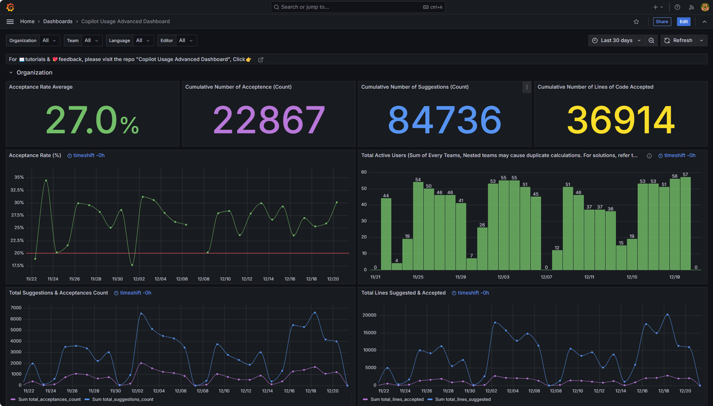

or


